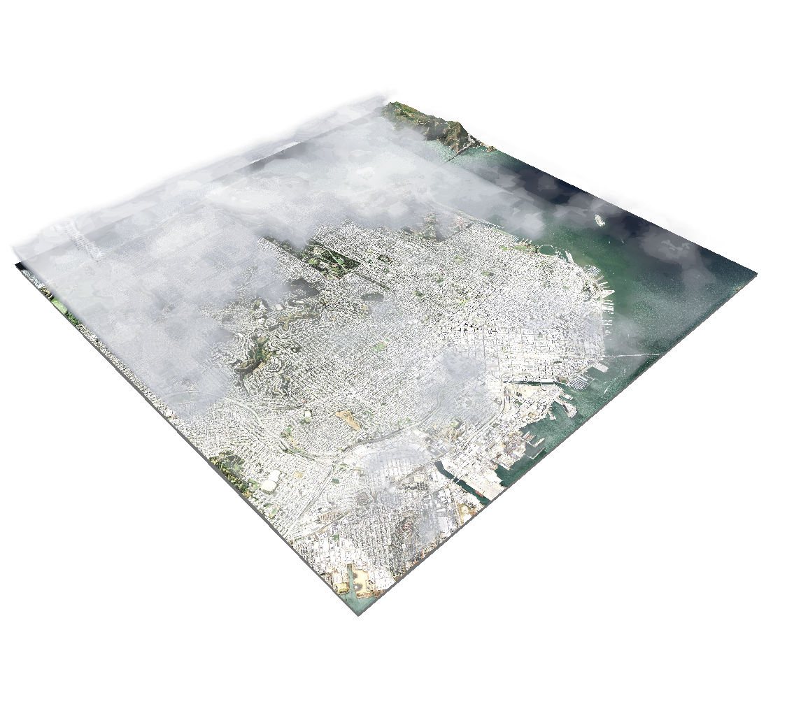

# SceneKit Volumetric Weather

### Overview

This project demonstrates how to create volumetric effects from map data using a Metal shader with SCNProgram. It's a companion to [this post](https://blog.mapbox.com/3d-weather-with-scenekit-aka-karl-the-fog-in-ar-931cff1c1c7c) about volumetric weather.

The example uses the most recent data from [Real Earth](http://realearth.ssec.wisc.edu/) to render volumetric clouds over San Francisco.

### Installation

1. Clone this repo.

1. Open `mapbox-volumes.xcodeproj` in Xcode and select the **mapbox-volumes** scheme.

1. Ensure the target links the **MetalKit** framework. It is required for loading the `.ktx` textures at runtime.

1. Build and run on a physical device.

### Volume textures

Sample 3‑D textures are included in `mapbox-volumes/art.scnassets` as `densityVolume.ktx` and `noiseVolume.ktx`.  These files are bundled with the app and loaded using `MTKTextureLoader` from **MetalKit**.  Any custom cloud data should be provided in **KTX** or **PVR** format with cubic, power‑of‑two dimensions (for example `64x64x64` or `128x128x128`).  Higher resolutions produce smoother clouds at the cost of GPU memory.

### Troubleshooting

1. Because the sample uses up-to-date satellite imagery, clouds won't appear on clear days or after dark. To view a specific time of day, you can modify the tile request using [RealEarth's documentation](http://realearth.ssec.wisc.edu/doc/).

1. The volumetric rendering is done using a [Metal](https://developer.apple.com/metal/) shader, and isn't compatible with the iOS simulator. Build to a physical device for the best results.

### License

scenekit-volumetric-weather is [licensed under BSD2](https://github.com/mapbox/scenekit-volumetric-weather/blob/master/LICENSE.md). If you build something with this code, please mention it in your readme so that others can learn about the resource.
